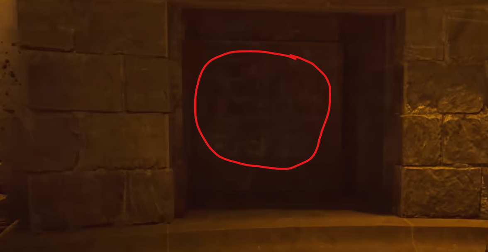

# Fire Bow Guide

## Note:
* Need the Wrath of the Ancients

## Steps

### Step 1:
At the top of the clocktower, shoot the wall with the Wrath of the Ancients where the back of the clock is.\
\
\
\
The wall will blow open and a broken arrow will be available for pickup.

### Step 2:
At the rocket pad, wait for the rocket to do a test burn. Once done, as quickly as you can, run out and to the right up high with the Wrath of the Ancients shoot this glowing rock:\
\
\
\
It will only be glowing for a very short period of time, make sure you directly hit the glowing section of the rock. If done correctly a stream of fire will fly through the air.\
\

### Step 3:
There will now be three glowing rings on the map. They will only be glowing when you are flying through the air via a Wundersphere. Shoot the glowing rings with the Wrath of the Ancients while in the air using a Wundersphere. If done correctly, the ring should glow even while you are on the ground. Do this for all three locations.

#### Ring locations:
Taking the Wundersphere from the rocket pad to the castle or back to the rocket pad, the ring will be on the bridge to the right of spawn.\
\
\
Taking the Wundersphere in the clocktower courtyard, the ring is in the safe area of the Deathray here:\
\
\
Taking the Wundersphere above Double Tap 2, the ring is next to the clock tower where you will be landing.\

### Step 4:
Kill about ten zombies close to the ring while you are standing in each ring. Your screen will have an orange border if you are standing in the ring. If done right the souls will go into the ring. Do this for all three rings. You can use any method to kill zombies for this step.

### Step 5:
Interact with the back of the clock in the clocktower, the same spot where the broken arrow was collected.\
\
\
\
A symbol will be revealed, take note of it.\
\
\
\
There are several fireplaces around the map that have symbols on the back of them.\
\
\
\
The locations of all will be shown shortly. One fireplace will have the same symbol as the one in the clock tower, the correct fireplace. One of the rings will be in the vicinity of the correct fireplace, all of the rings for each fireplace will also be shown shortly. You must be standing in the ring so that the same orange border is present on your screen from earlier, shoot the Wrath of the Ancients so the shot lands on the ground and a molten rock will appear where it landed.\
\
\
\
This molten rock will grant the player the orange border effect which will in turn spawn another molten rock where the next arrow lands. This will only last for three shots, which is the three molten rocks. Your goal is to chain these rocks to make it to the correct fireplace, lighting it by shooting an arrow into it while having the orange border on your screen.\
\
\
\
If you fire the Wrath of the Ancients while not standing in the right spot it will reset. Additionally, it will reset after the fourth shot is fired meaning, you can light the fireplace with the fourth shot, the one where you are standing in the third and final molten rock. If failed start again from the ring provided you have enough arrows. Try to use the arc of the arrows to help chain your locations effectively, you will only be able to spawn three molten rocks to get within range of the correct fireplace. If done correctly a Max Ammo will spawn in and you can interact with the fireplace and pick up the arrow that is there.

#### Fireplace locations:
In the living quarters to the right when entering from outside, the ring is on the bridge next to spawn.\
\
\
In the church below a dragon head location, the ring is next to the clock tower.\
\
\
In the supply room which is up the stairs next to the dragon head spawn by Double Tap 2, the ring is on the bridge next to spawn.\

### Step 6:
Interact with the big molten ball at the Deathray, it will burst into an arrow to pick up. Interact with the box in the undercroft here:\
\
\
\
Only you must get kills near the box until the arrow is glowing, interact with it while the Wrath of the Ancients is out. Pick up the Fire Bow.
